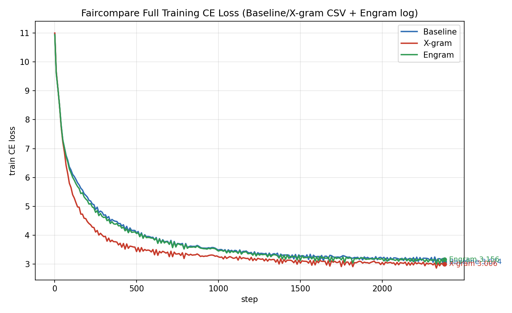
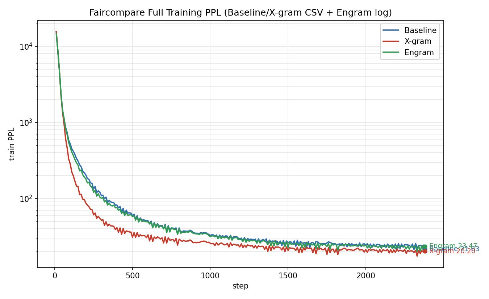
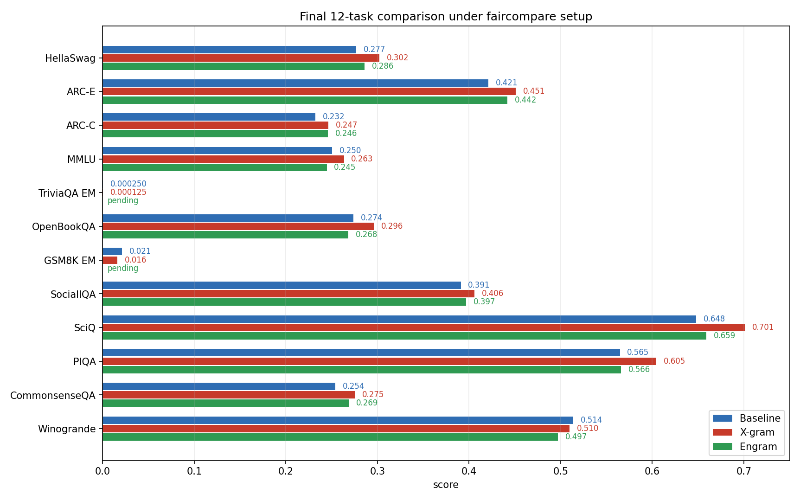
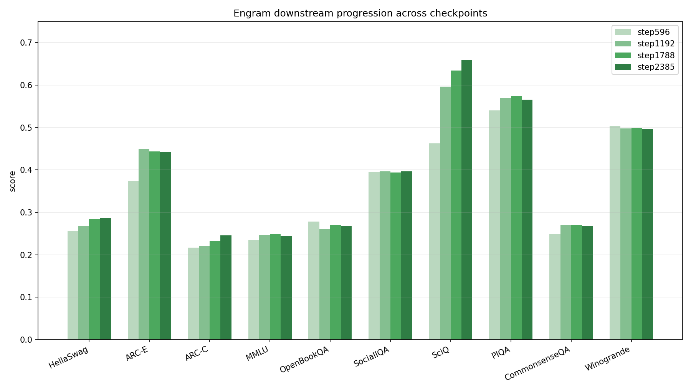
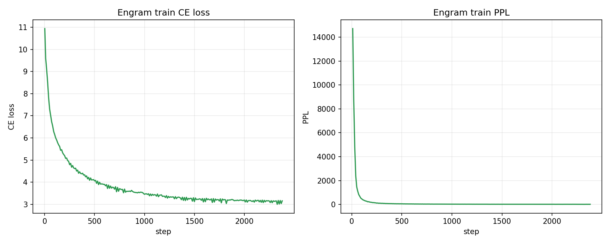

tm# Engram 实验成功汇报报告

日期：2026-07-20  
目的：用于组会汇报本次 faircompare 口径下 Engram、X-gram、Baseline 的训练与下游对比。  
说明：本报告严格区分“已验证事实”和“待补充结果”，不把仍在运行中的 Engram 生成式评测写成既定结论。

---

## 1. bg

本次汇报采用当前仓库内已经完成的 `faircompare_*_360m` 正式实验口径，在相同 `SmolLM2-360M-style` 主干、相同 `FineWeb 10B tokens`、相同 `global_batch_size=512`、相同 `train_tokens=10,000,000,000` 下，对比 `Baseline`、`X-gram` 与压缩公平版 `Engram`。

本轮目标不是继续讨论旧版错误实验，而是给出当前真正可对齐的三模型结果，并把 Engram 的 checkpoint 演化、三模型终点下游任务结果、以及当前仍待补充的生成式任务状态明确区分开。

## 3. Experimental Setup

### 3.1 已确认事实

| 项目 | Baseline | X-gram | Engram |
|:--|:--|:--|:--|
| Backbone | SmolLM2-360M-style 32-layer decoder | 相同 | 相同 |
| `num_layers` | 32 | 32 | 32 |
| `hidden_size` | 960 | 960 | 960 |
| `ffn_hidden_size` | 2560 | 2560 | 2560 |
| `num_attn_heads` | 15 | 15 | 15 |
| `num_query_groups` | 3 | 3 | 3 |
| Dataset | FineWeb 10B tokens streaming | 相同 | 相同 |
| `global_batch_size` | 512 | 512 | 512 |
| `train_tokens` | 10,000,000,000 | 10,000,000,000 | 10,000,000,000 |
| `lr` | 3e-4 | 3e-4 | 3e-4 |
| Evaluation during train | downstream disabled | 相同 | 相同 |
| Config | `configs/faircompare_baseline_360m.yaml` | `configs/faircompare_xgram_360m.yaml` | `configs/faircompare_engram_360m.yaml` |

### 3.2 Engram 额外配置

| 项目 | Engram 设置 | 作用 |
|:--|:--|:--|
| `embedding_injection.mode` | `Engram` | 启用 Engram 注入 |
| `h_layers` | `[0..31]` | 在 32 层 H-path 全覆盖注入 |
| `engram_mode` | `2gram+3gram` | 同时使用 2-gram 与 3-gram 信息 |
| `engram_dim_per_ngram` | `192` | 压缩版 n-gram 表示维度 |
| `engram_ngram_heads` | `2` | n-gram 头数 |
| `engram_ngram_target_buckets` | `16384` | 压缩版 n-gram bucket 容量 |
| `engram_shortconv_kernel` | `4` | 局部短卷积窗口 |

### 4.2 修改

- 删除了冻结 backbone 的错误设置，保证主干参与训练。
- 将 Engram 调整为当前硬件可跑完的压缩公平版，而不是继续坚持 OOM 的完全大规模版。
- 新增 checkpoint 自动评测链路，使 `step596/1192/1788/2385` 均有 Engram 下游结果。

Why:

- 旧版“能跑”的 Engram 不是当前 faircompare 口径，也不能直接与本轮 baseline/xgram 做正式对照。
- 完全大规模 Engram 在当前卡型上会 OOM，无法形成完整终点结果。
- 用户当前的对照需求是“能完整跑通并和 baseline/xgram 做组会对比”，因此采用压缩公平版是当前可验证方案。

## 5. Experimental Results

### 5.1 图像证据

三模型训练 `CE loss` 对比

三模型训练 `PPL` 对比

三模型终点 12 任务对比

Engram checkpoint 演化

Engram 训练曲线

### 5.2 三模型训练末端数值

| 模型 | 最后可见 step | Train CE loss | Train PPL |
|:--|:--|:--|:--|
| Baseline | 2380 | 3.074 | 21.63 |
| X-gram | 2380 | 3.006 | 20.20 |
| Engram | 2380 | 3.156 | 23.47 |

说明：

- 上面的两张训练图展示的是三模型在相同 faircompare 配置下的全程训练趋势。
- `Baseline / X-gram` 曲线来自各自完整的 `reports/*_full_metrics.csv`。
- `Engram` 曲线来自当前完整的 `faircompare_engram_360m_rank0.log` 解析结果。
- 因此图和表格现在都只对应当前这轮 faircompare 实验，不再混用旧实验图像。

### 5.3 三模型下游任务终点对比

| 指标 | Baseline | X-gram | Engram |
|:--|:--|:--|:--|
| HellaSwag | 0.2766 | 0.3020 | 0.2860 |
| ARC-E | 0.4211 | 0.4509 | 0.4421 |
| ARC-C | 0.2321 | 0.2466 | 0.2457 |
| MMLU | 0.2505 | 0.2634 | 0.2446 |
| TriviaQA EM | 0.000250 | 0.000125 | 0.001501 |
| OpenBookQA | 0.2740 | 0.2960 | 0.2680 |
| GSM8K EM | 0.0212 | 0.0159 | 未完成 |
| SocialIQA | 0.3910 | 0.4058 | 0.3966 |
| SciQ | 0.6480 | 0.7010 | 0.6590 |
| PIQA | 0.5647 | 0.6045 | 0.5658 |
| CommonsenseQA | 0.2539 | 0.2752 | 0.2686 |
| Winogrande | 0.5138 | 0.5099 | 0.4972 |

### 5.4 已验证事实

- `Engram` 正式训练已经完成，最终 checkpoint 为 `runs/faircompare-engram-360m-88169/step2385`。
- `Baseline/X-gram/Engram` 在用户要求的 12 项里，已有 10 项判别式任务结果可直接三模型对比。
- `Engram` 的 `step596 -> step1192 -> step1788 -> step2385` 下游任务整体呈上升或持平趋势，其中 `SciQ` 提升最明显。

### 5.5 结果状态补充

- `Engram` 的 `TriviaQA EM` 已完成，最终为 `12 / 7993 = 0.001501`。
- `Engram` 的 `GSM8K EM` 本轮没有完成，不是因为结果缺失，而是 `89577` 在生成到 `950 / 1319` 时被 `time limit` 强制中断。
- 因此当前 12 任务表中：
  - `TriviaQA EM` 已可正式填入。
  - `GSM8K EM` 应标记为“未完成”，而不是继续写成“待补充但正在跑”。

### 5.6 为什么这次 Engram 比 X-gram 更差

- 当前跑通的不是之前想要的完整大规模 Engram，而是为了避免 OOM 采用的压缩 faircompare 版。
- 这版 Engram 的关键容量明显更小：
  - `engram_dim_per_ngram = 192`
  - `engram_ngram_target_buckets = 16384`
- 因此它首先解决的是“能公平训练完”，而不是“容量仍与原始大规模 Engram 等价”。
- 在当前这组压缩超参下，结果说明：
  - `X-gram` 仍然是三者里最稳、最强的方案。
  - `Engram` 虽然已经训练有效，但还没有调到优于 `X-gram` 的区间。

### 5.7 为什么之前的 Engram 看起来好很多

- 之前你看到的更强 Engram 数值，不应直接和这次 faircompare 压缩版混看。
- 原因主要有两类：
  - 之前引用过的部分结果来自旧实验口径，和当前 faircompare 不是同一设置。
  - 之前讨论的 Engram 目标配置本来容量更大，但那一版在当前硬件上会 OOM，最终没有形成这次这样完整可对齐的正式终点结果。
- 所以“之前更好很多”和“这次更差”并不矛盾，本质上是在比较两种不同条件下的 Engram：
  - 一种是更大、更强、但当前硬件无法稳定完整跑通的目标版本。
  - 一种是当前真正跑通并可正式对照的压缩 faircompare 版本。

## 6. 当前结论

- 如果只看当前已经完成并可严格对齐的 10 个判别式任务，`X-gram` 整体仍然是三者里最强的稳定方案。
- 当前压缩公平版 `Engram` 已经成功形成完整训练和终点 checkpoint，但其终点训练指标与下游结果整体仍弱于 `X-gram`，与 `Baseline` 接近或略有波动。
- 因此本轮最重要的成功，不是“Engram 已经超过 X-gram”，而是“Engram 在当前 faircompare 工程口径下已经能完整训练并可被正式评测”，这为后续继续调参和下游分析建立了有效起点。
