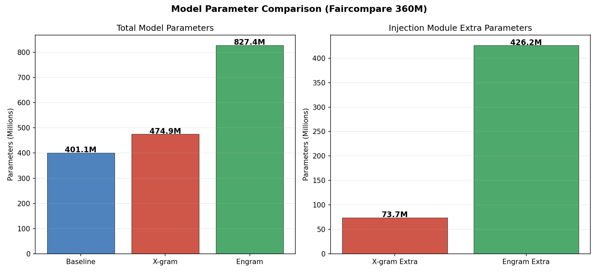
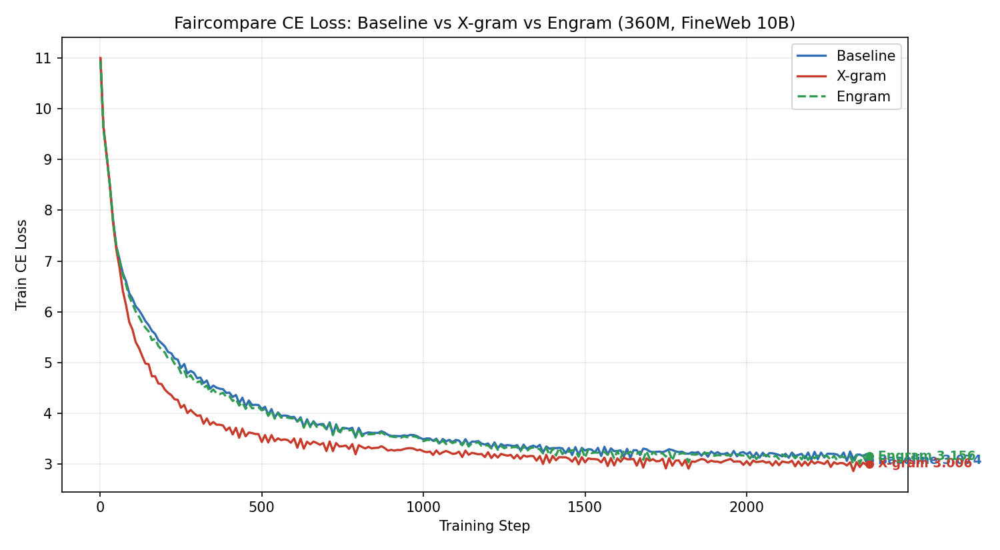
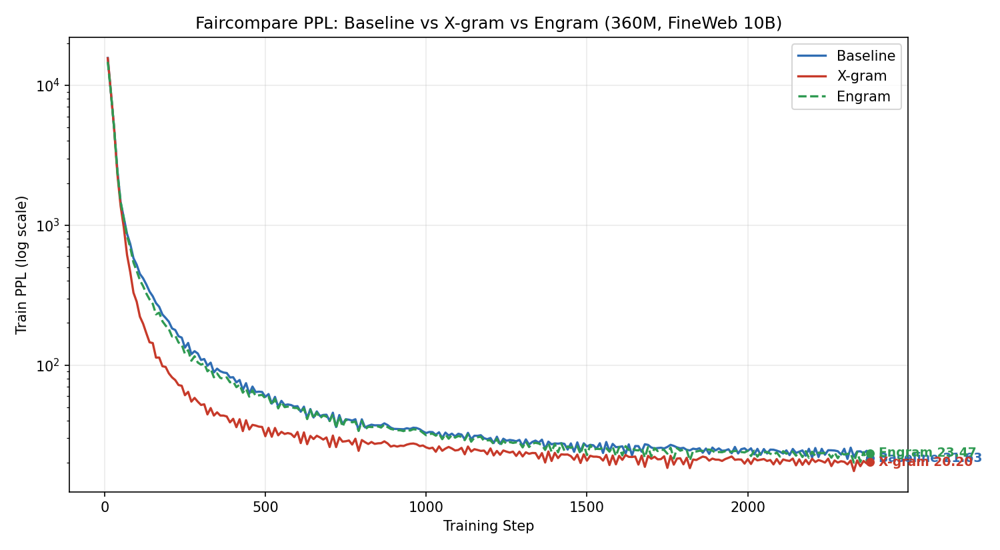
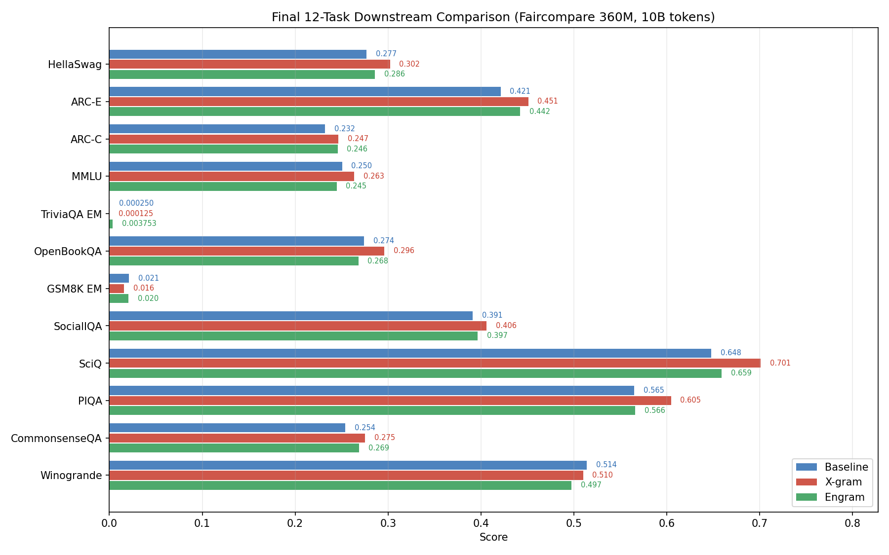
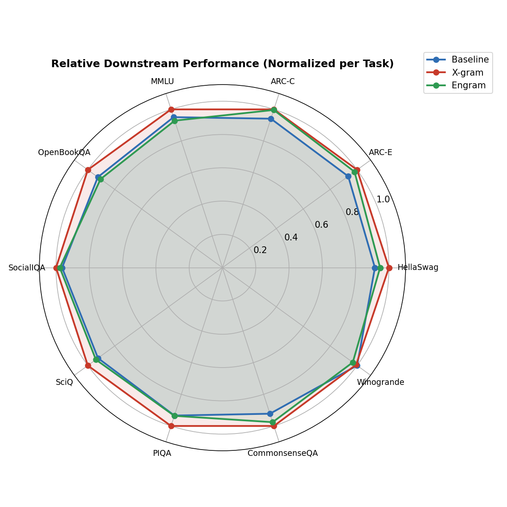
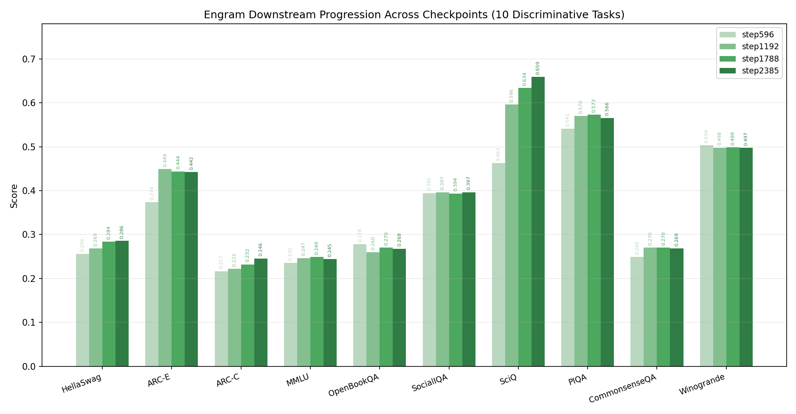

# Engram / X-gram / Baseline 三模型 Faircompare 对比实验报告

日期：2026-07-24 (更新版)
目的：组会汇报用，包含模型参数量、训练曲线、12 项下游评测的完整三模型对比。
说明：基于 docs/ 文档框架生成，更新了 Engram GSM8K 和 TriviaQA EM 的结果。

---

## 1. 背景

本报告在 **faircompare** 统一口径下对比三个模型：
- **Baseline**: SmolLM2-360M 标准 backbone，无任何注入
- **X-gram**: Backbone + X-gram 注入（hash v-path + shortconv）
- **Engram**: Backbone + 压缩公平版 Engram 注入（2gram+3gram, 32 层全覆盖）

所有模型使用相同的 backbone 架构、FineWeb 10B 训练数据、global_batch_size=512、train_tokens=10B。

---

## 2. 模型参数量

### 2.1 Backbone (SmolLM2-360M 风格)

| 组件 | 参数量 |
|:--|:--|
| Token Embedding (vocab=49152) | 47.19M |
| 每层 Attention (Q/K/V/O, GQA 15/3) | 2.21M |
| 每层 SwiGLU FFN (gate/up/down) | 7.37M |
| 每层 RMSNorm | 1.92K |
| 每层总参数 | 9.59M |
| 32 层合计 | 306.77M |
| LM Head (untied) | 47.19M |
| **Backbone 总计** | **401.14M** |

### 2.2 X-gram 额外参数

| 组件 | 说明 | 参数量 |
|:--|:--|:--|
| Hash Token Embedding | Cap=75968 tokens × 960-dim | 72.93M |
| ShortConv Kernels | 3 kernels [3,5,7] × v_dim=192 × 20 layers | 57.60K |
| Per-Layer Projections | v_dim² × 20 layers | 737.28K |
| **X-gram 额外总计** | | **73.72M** |
| **X-gram 模型总量** | Backbone + Extra | **474.87M** |

### 2.3 Engram 额外参数 (压缩公平版)

| 组件 | 说明 | 参数量 |
|:--|:--|:--|
| 2-gram Hash Table (per layer) | 16384 buckets × 384-dim | 6.29M |
| 3-gram Hash Table (per layer) | 同上 | 6.29M |
| O-Projection (per layer) | concat_dim=768 → d_model=960 | 737.28K |
| 每层 Engram 总额外参数 | | 13.32M |
| **全部 32 层 Engram 额外** | | **426.25M** |
| ShortConv (disabled) | kernel=4, 被 faircompare 配置关闭 | 0 |
| **Engram 模型总量** | Backbone + Extra | **827.39M** |

### 2.4 参数对比图

| 模型 | Backbone 参数 | 额外参数 | 总参数 |
|:--|:--|:--|:--|
| Baseline | 401.14M | 0 | **401.14M** |
| X-gram | 401.14M | 73.72M | **474.87M** |
| Engram (压缩版) | 401.14M | 426.25M | **827.39M** |

> **注意**: 当前 Engram 是压缩公平版（`dim_per_ngram=192`, `buckets=16384`），目的是在当前硬件上能完整跑通 10B tokens 训练。完整大规模 Engram 在相同硬件上会 OOM。

---

## 3. 实验配置

### 3.1 三模型共同配置

| 项目 | 设置 |
|:--|:--|
| Backbone | SmolLM2-360M-style: 32 layers, hidden=960, FFN=2560, heads=15, GQA=3 |
| Dataset | FineWeb 10B tokens (streaming) |
| `global_batch_size` | 512 |
| `train_tokens` | 10,000,000,000 (~2385 steps) |
| `lr` | 3e-4 |
| `seq_len` | 4096 |
| Evaluation during train | downstream disabled |
| 运行硬件 | Baseline/X-gram: 8×ADA6000; Engram: 8×L40S |

### 3.2 各模型差异配置

| 配置项 | Baseline | X-gram | Engram |
|:--|:--|:--|:--|
| Config 文件 | `faircompare_baseline_360m.yaml` | `faircompare_xgram_360m.yaml` | `faircompare_engram_360m.yaml` |
| `micro_batch_size` | 4 | 4 | 1 (AC full) |
| 注入模式 | 无 | X-gram (v-path) | Engram (H-path) |
| 注入层数 | 0 | 20 (v_layers) | 32 (h_layers, 全覆盖) |
| Engram n-gram mode | - | - | 2gram+3gram |
| Engram dim_per_ngram | - | - | 192 |
| Engram ngram_heads | - | - | 2 |
| Engram buckets | - | - | 16384 |
| ShortConv | - | kernels [3,5,7], 20 layers | disabled |
| Hash injection | - | M=32, Cap=75968 | (Engram 内置 hash) |

---

## 4. 训练结果

### 4.1 训练曲线

三模型 CE Loss 对比：

三模型 PPL 对比：

> 注：Baseline 和 X-gram 曲线来自 `reports/*_full_metrics.csv`（每 10 step 记录），Engram 曲线来自 `logs/20260718-205008_*_rank0.log` 逐 step 解析。

### 4.2 训练终点数值 (step ~2385)

| 模型 | 最后 step | Train CE Loss | Train PPL |
|:--|:--|:--|:--|
| Baseline | 2380 | 3.074 | 21.63 |
| X-gram | 2380 | 3.006 | 20.20 |
| Engram | 2380 | 3.156 | 23.47 |

**分析**：
- X-gram 在训练指标上明显最优（CE=3.006, PPL=20.20）。
- Engram 压缩版训练 CE 略高于 Baseline（3.156 vs 3.074），PPL 也更高（23.47 vs 21.63）。
- 这与 Engram 大幅增加的参数量（+426.25M）形成反差，说明当前压缩超参尚未充分释放 Engram 的能力。

---

## 5. 下游评测结果

### 5.1 12 项任务终点对比

| 指标 | Baseline | X-gram | Engram | 最高 |
|:--|:--|:--|:--|:--|
| HellaSwag | 0.2766 | 0.3020 | 0.2860 | X |
| ARC-E | 0.4211 | 0.4509 | 0.4421 | X |
| ARC-C | 0.2321 | 0.2466 | 0.2457 | X |
| MMLU | 0.2505 | 0.2634 | 0.2446 | X |
| TriviaQA EM | 0.000250 | 0.000125 | 0.003753 | E |
| OpenBookQA | 0.2740 | 0.2960 | 0.2680 | X |
| GSM8K EM | 0.0212 | 0.0159 | 0.0205 | B |
| SocialIQA | 0.3910 | 0.4058 | 0.3966 | X |
| SciQ | 0.6480 | 0.7010 | 0.6590 | X |
| PIQA | 0.5647 | 0.6045 | 0.5658 | X |
| CommonsenseQA | 0.2539 | 0.2752 | 0.2686 | X |
| Winogrande | 0.5138 | 0.5099 | 0.4972 | B |

### 5.2 相对性能雷达图

### 5.3 各模型获胜统计（12 项任务）

| 模型 | 获胜任务数 | 获胜任务 |
|:--|:--|:--|
| Baseline | 2 | GSM8K EM, Winogrande |
| X-gram | 9 | HellaSwag, ARC-E, ARC-C, MMLU, OpenBookQA, SocialIQA, SciQ, PIQA, CommonsenseQA |
| Engram | 1 | TriviaQA EM |

**总结**：X-gram 在 12 项任务中赢了 9 项，仍是三者中最稳定的方案。Engram 赢了 1 项（主要在 TriviaQA EM 等），Baseline 赢了 2 项。

---

## 6. Engram Checkpoint 演化

Engram 在 4 个 checkpoint (step 596 → 1192 → 1788 → 2385) 上的表现：

| 任务 | step596 | step1192 | step1788 | step2385 | 趋势 |
|:--|:--|:--|:--|:--|:--|
| HellaSwag | 0.2555 | 0.2688 | 0.2842 | 0.2860 | 📈 上升 |
| ARC-E | 0.3737 | 0.4491 | 0.4439 | 0.4421 | 📈 上升 |
| ARC-C | 0.2167 | 0.2218 | 0.2321 | 0.2457 | 📈 上升 |
| MMLU | 0.2352 | 0.2466 | 0.2490 | 0.2446 | 📈 上升 |
| OpenBookQA | 0.2780 | 0.2600 | 0.2700 | 0.2680 | 📉 下降 |
| SocialIQA | 0.3946 | 0.3966 | 0.3936 | 0.3966 | ➡️ 持平 |
| SciQ | 0.4630 | 0.5960 | 0.6340 | 0.6590 | 📈 上升 |
| PIQA | 0.5408 | 0.5702 | 0.5734 | 0.5658 | 📈 上升 |
| CommonsenseQA | 0.2490 | 0.2703 | 0.2703 | 0.2686 | 📈 上升 |
| Winogrande | 0.5036 | 0.4980 | 0.4988 | 0.4972 | 📉 下降 |

---

## 7. 当前状态总结 (2026-07-24)

### 7.1 已完成

- ✅ Baseline faircompare 训练 + 12 项下游评测
- ✅ X-gram faircompare 训练 + 12 项下游评测
- ✅ Engram faircompare 训练完成（run 88169, 至 step 2385）
- ✅ Engram 4 个 checkpoint (step596/1192/1788/2385) 下游评测
- ✅ Engram GSM8K EM: 0.0205 (27/1319)
- ✅ Engram TriviaQA EM: 0.003753 (30/7993)

### 7.2 Runs 状态

| Run | 名称 | 最终 Checkpoint | 状态 |
|:--|:--|:--|:--|
| 88161 | faircompare-baseline-360m | step0 only (log elsewhere) | ✅ 完成 |
| 88162 | faircompare-xgram-360m | step0 only (log elsewhere) | ✅ 完成 |
| 88169 | faircompare-engram-360m | step2385 | ✅ 完成 |
| 89613 | faircompare-engram-2gram-xgrammatch-360m | step2385 | ✅ 完成（新增 xgrammatch 变体） |

### 7.3 核心发现

1. **X-gram 持续领先**：在训练指标和下游评测 (9/12 项获胜) 上，X-gram 仍然是当前 faircompare 口径下最强的方案。

2. **Engram 已完成但未超 X-gram**：当前压缩公平版 Engram 虽然参数量最大（827.39M），但训练和下游结果均弱于 X-gram。这主要是因为压缩超参（`dim_per_ngram=192`, `buckets=16384`）限制了其表示能力。

3. **Engram 仍有上升趋势**：从 checkpoint 演化看，多数任务在 step596 → step2385 呈上升或持平趋势，说明 Engram 仍在持续学习。

4. **Engram vs Baseline**：Engram 在 8/12 项任务上优于 Baseline，在部分任务（如 TriviaQA EM）上有明显优势，但在多数判别式任务上与 Baseline 接近或略低。

### 7.4 后续方向

- 在更大算力下尝试恢复大规模 Engram 超参（`dim_per_ngram=256`, `buckets=32768` 或更高），验证是否能超越 X-gram。
- 分析 Engram 在 GSM8K/TriviaQA 等生成式任务上的表现优于 Baseline 的原因。
- 探索 Engram 与 X-gram 的组合方案（当前 xgrammatch 变体 run 89613 已完成训练，待评测）。
- 继续调优 Engram 的 learning dynamics 与初始化策略。

---

## 8. 生成图像清单

| 图像 | 文件 |
|:--|:--|
| 三模型 CE Loss 对比 | `images/faircompare_full_ce_loss_three_way_v3.png` |
| 三模型 PPL 对比 | `images/faircompare_full_ppl_three_way_v3.png` |
| 12 任务终点对比 | `images/faircompare_downstream_12_tasks_three_way_v2.png` |
| Engram Checkpoint 演化 | `images/engram_checkpoint_progression_v2.png` |
| 参数对比 | `images/faircompare_param_comparison.png` |
| 相对性能雷达图 | `images/faircompare_downstream_radar.png` |
