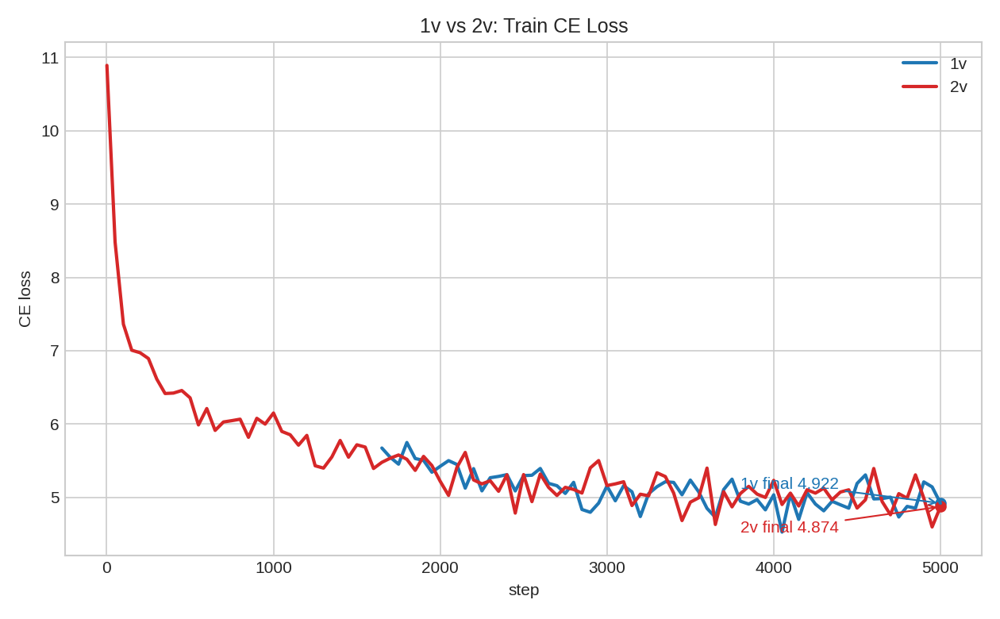
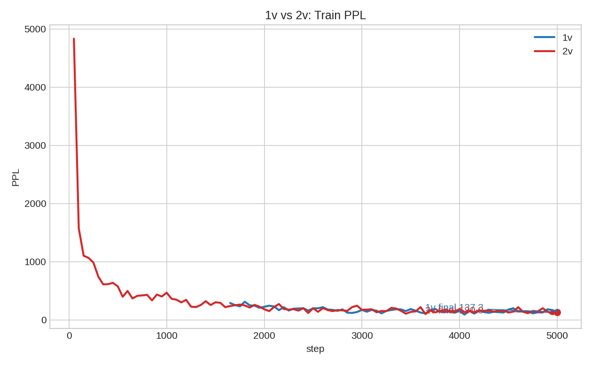
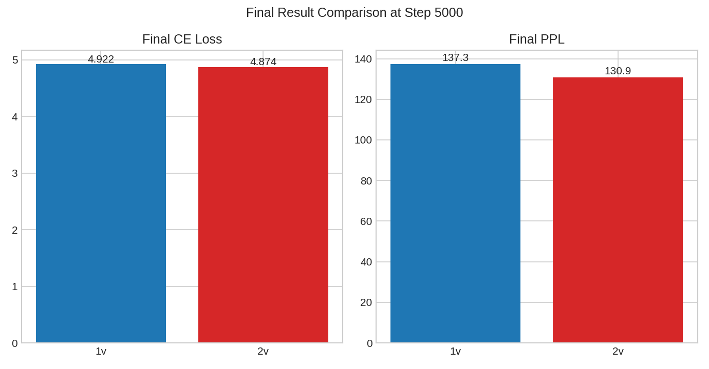

# ComEmbed 2v 最新结果与 1v 对比报告

日期：2026-07-24

## 1. 结论

截至 2026-07-24，最新可交付的完整 2v 结果是 `comembed-fanormqr-2v-overnight5000-stabilized`，它已经稳定跑完 5000 step，并在训练终点上略优于已完成的 1v overnight5000：

| 模型 | 运行状态 | 最后 step | tokens | Train CE loss | Train PPL | total grad norm |
|---|---:|---:|---:|---:|---:|---:|
| 1v `fa_add_qr` | 完成 | 5000/5000 | 20,480,000 | 4.922 | 137.3 | 0.8596 |
| 2v `fa_norm_qr stabilized` | 完成 | 5000/5000 | 20,480,000 | 4.874 | 130.9 | 0.7835 |

相对 1v，2v stabilized 的终点：

- CE loss 降低 0.048，约 0.98%。
- PPL 降低 6.4，约 4.66%。
- 总梯度范数更低：0.7835 vs 0.8596。

这说明稳定化后的 2v 已经不再是“只能 smoke、不能正式跑”的失败状态，并且在同样 5000 step、同样 token 数的训练终点上有小幅收益。

## 2. 使用的实验

### 2.1 1v 对照

- 配置：`configs/our_comembed_faaddqr_1v_overnight5000.yaml`
- 日志：`logs/20260711-171733_our_comembed_faaddqr_1v_overnight5000_rank0.log`
- run：`runs/our_comembed_faaddqr_1v_overnight5000-83745`
- 结构：`targets: [v]`，`v_layers: [0]`
- 变体：`comembed_variant: fa_add_qr`
- 训练长度：20,480,000 tokens，5000 step

### 2.2 2v 完整结果

- 配置：`configs/our_comembed_fanormqr_2v_overnight5000_stabilized.yaml`
- 日志：`logs/20260717-135026_our_comembed_fanormqr_2v_overnight5000_stabilized_rank0.log`
- run：`runs/our_comembed_fanormqr_2v_overnight5000_stabilized-86769`
- 结构：`targets: [v]`，`v_layers: [0, 0]`
- 变体：`comembed_variant: fa_norm_qr`
- 稳定化设置：`comembed_gate_init: 1.0e-5`，`comembed_disable_row_gate: true`，`comembed_output_rmsnorm: true`，`lambda_init: 1.0e-4`，`lambda_warmup_steps: 5000`
- 训练长度：20,480,000 tokens，5000 step

## 3. 图表

重新生成的图表如下：

### 3.1 CE loss 曲线

### 3.2 PPL 曲线

### 3.3 终点柱状图

生成脚本：

- `scripts/build_2v_1v_compare_figures.py`

## 4. 需要注意的解释边界

这个对比不是一个完全干净的“只改 1v/2v”的 ablation。1v 使用的是 `fa_add_qr`，2v 使用的是稳定化后的 `fa_norm_qr`，并额外启用了更保守的 gate、lambda warmup 和输出 RMSNorm。因此这里能支持的结论是：

> 稳定化 2v 方案已经可以完成 5000-step 正式训练，并且终点训练指标小幅优于当前 1v 对照。

这里不能过度解读为：

> 任意原始 2v 结构都已经稳定，或者 2v 单独因素必然优于 1v。

另一个重要现象是：2v stabilized 日志中出现了 5000 次 `Sanitized non-finite gradients` warning。虽然最终 total grad norm 保持有限并完成训练，但这说明它仍然依赖梯度清洗路径维持数值稳定；汇报时应该把它表述为“修复后可运行且有效”，而不是“数值问题已经彻底消失”。

## 5. 最新 partial formal 状态

仓库里还有更新的 2v formal 运行：

- 配置：`configs/our_comembed_fanormqr_2v_formal_8x4090_fit.yaml`
- 日志：`logs/20260719-124226_our_comembed_fanormqr_2v_formal_8x4090_fit_rank0.log`
- run：`runs/our_comembed_fanormqr_2v_formal_8x4090_fit-88857`
- 最后可见日志点：step 1400/2385，Train CE loss 3.333，Train PPL 28.01，total grad norm 0.2203
- 现有 checkpoint：step0、step596、step1192、step1357

这条 formal 线日期更新、规模更接近正式训练，但目前未见 `Training complete`，并且配置与 1v overnight5000 差别较大：`text_chunk_size: 4096`、`global_batch_size: 512`、`train_tokens: 10000000000`，且 `v_layers` 覆盖 0 到 9 层的重复 2v 注入。因此它暂时只能作为“最新 partial 进展”，不能替代上面的 5000-step 对比结论。

## 6. 汇报口径

建议汇报时使用下面这句话：

> ComEmbed 2v 已经从原始设定的早期 NaN 失败，推进到稳定化 `fa_norm_qr + 2v` 可以完整完成 5000 step；在同等 20.48M token 的训练终点上，2v 的 CE loss 为 4.874，低于 1v 的 4.922，PPL 为 130.9，低于 1v 的 137.3。但该收益来自稳定化 2v 配方，不是严格的单因素 2v ablation，且训练中仍依赖 non-finite gradient sanitize。
