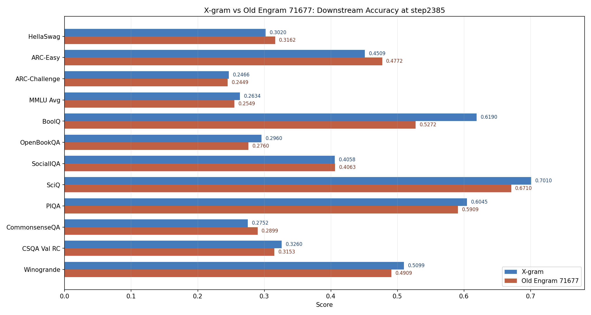
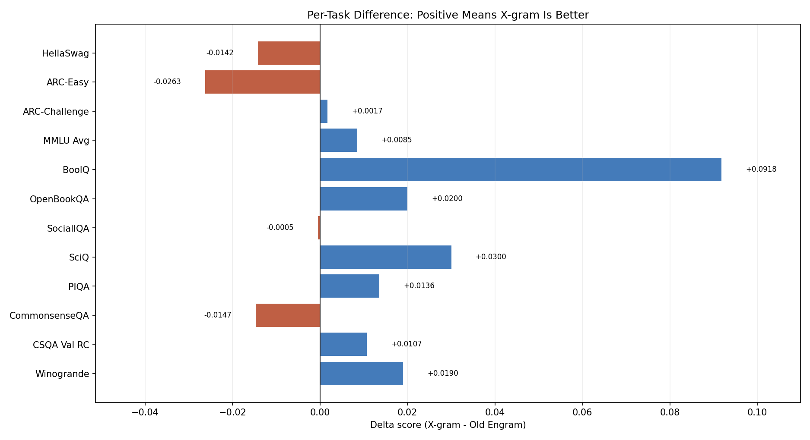

# X-gram vs Old Engram 下游任务对比报告

日期：2026-07-24
目的：对比 X-gram 与历史 old Engram 在下游判别式任务上的终点评测效果。
说明：格式参考 `docs/19_Docs_总合并版.md`。这里的 old Engram 指 `runs/engram-smollm2-360m-fineweb10b-71677/step2385`，不是当前 faircompare 压缩版 Engram。

---

## 1. bg

本报告只回答一个问题：在相同 12 项 downstream 汇总口径下，X-gram 与历史 old Engram 谁的终点下游效果更好。

需要特别区分的是，old Engram 71677 是历史大模型口径，评测日志显示总参数量约 9.90B；X-gram 对照约 694.5M。因此本报告可用于观察效果差异，但不应当被表述为严格参数公平对比。

## 2. Objective

1. 复用已有 step2385 下游评测日志，抽取 12 项任务分数。
2. 生成 X-gram 与 old Engram 的任务级柱状图。
3. 生成 `X-gram - Old Engram` 的差值图，明确每项任务谁领先。
4. 给出组会可直接引用的结论口径。

## 3. Experimental Setup

### 3.1 评测输入

| 模型 | Checkpoint | Eval log | 参数量 |
|:--|:--|:--|:--|
| X-gram | `runs/xgram-smollm2-360m-fineweb10b-64971/step2385` | `logs/downstream_eval_xgram_step2385_full_20260606-162307.log` | 694.5M |
| Old Engram 71677 | `runs/engram-smollm2-360m-fineweb10b-71677/step2385` | `logs/downstream_eval_engram_oldbig71677_step2385_fullonly_full_20260724-124728-90819.log` | 9.90B |

### 3.2 任务口径

下表采用 filtered downstream 的 12 项汇总口径：`MMLU Avg` 加上 11 个单项任务。分数均为对应 evaluator 输出的 accuracy 或 length-normalized accuracy v2。old Engram 的完整评测完成于 2026-07-24 13:16:37，X-gram 的评测日志完成于 2026-06-06 16:31:39。

## 4. Results

### 4.1 总览

| 指标 | X-gram | Old Engram 71677 | 结论 |
|:--|:--|:--|:--|
| Global Average | 0.4167 | 0.4051 | X-gram 高 +0.0116 |
| 胜出任务数 | 8/12 | 4/12 | X-gram 覆盖面更稳 |
| 参数量 | 694.5M | 9.90B | Old Engram 约为 X-gram 的 14.3 倍 |

### 4.2 任务分数图

### 4.3 差值图

### 4.4 明细表

| 任务 | X-gram | Old Engram 71677 | 差值 X-gram - Old | 胜出 |
|:--|:--|:--|:--|:--|
| HellaSwag | 0.3020 | 0.3162 | -0.0142 | Old Engram |
| ARC-Easy | 0.4509 | 0.4772 | -0.0263 | Old Engram |
| ARC-Challenge | 0.2466 | 0.2449 | +0.0017 | X-gram |
| MMLU Avg | 0.2634 | 0.2549 | +0.0085 | X-gram |
| BoolQ | 0.6190 | 0.5272 | +0.0918 | X-gram |
| OpenBookQA | 0.2960 | 0.2760 | +0.0200 | X-gram |
| SocialIQA | 0.4058 | 0.4063 | -0.0005 | Old Engram |
| SciQ | 0.7010 | 0.6710 | +0.0300 | X-gram |
| PIQA | 0.6045 | 0.5909 | +0.0136 | X-gram |
| CommonsenseQA | 0.2752 | 0.2899 | -0.0147 | Old Engram |
| CSQA Val RC | 0.3260 | 0.3153 | +0.0107 | X-gram |
| Winogrande | 0.5099 | 0.4909 | +0.0190 | X-gram |

### 4.5 任务级观察

X-gram 领先最明显的任务是 BoolQ (+0.0918), SciQ (+0.0300), OpenBookQA (+0.0200)。这说明它在 BoolQ、SciQ 等常识/科学类判别任务上优势更稳定。

Old Engram 领先最明显的任务是 ARC-Easy (+0.0263), CommonsenseQA (+0.0147), HellaSwag (+0.0142)。它主要在 ARC-Easy、HellaSwag 和 CommonsenseQA 上超过 X-gram，但这些优势没有抵消 BoolQ 与 SciQ 上的较大落后。

## 5. Conclusion

在这组历史下游评测中，X-gram 的 Global Average 为 0.4167，高于 old Engram 71677 的 0.4051；12 项任务中 X-gram 赢 8 项，old Engram 赢 4 项。

因此建议汇报口径是：即使与约 9.90B 的历史大容量 Engram 对比，约 694.5M 的 X-gram 仍取得更高 downstream global average 和更好的任务覆盖面。old Engram 的个别任务收益存在，但整体稳定性和参数效率都弱于 X-gram。
