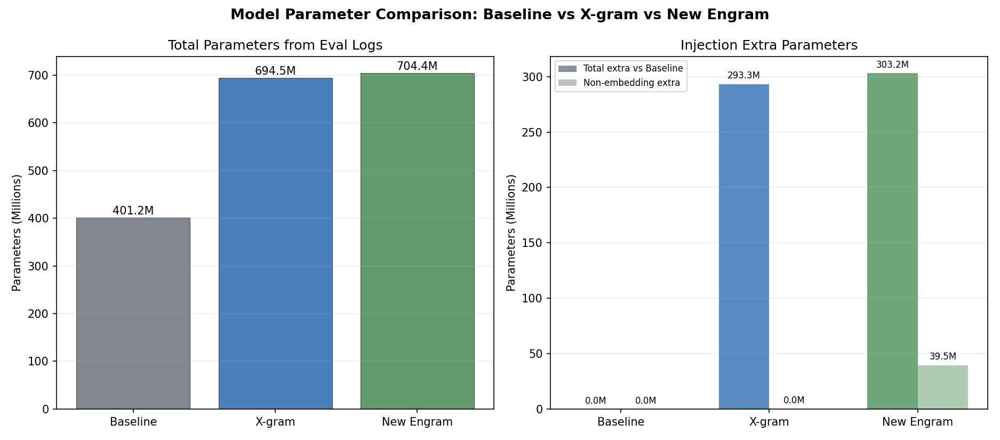
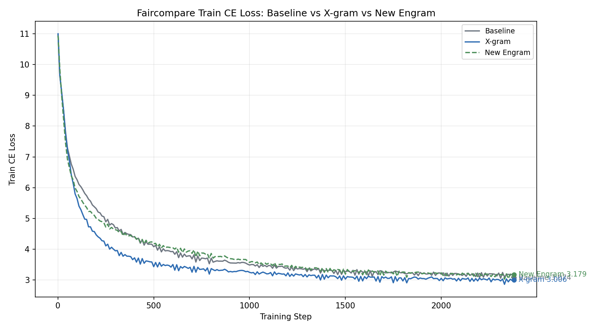
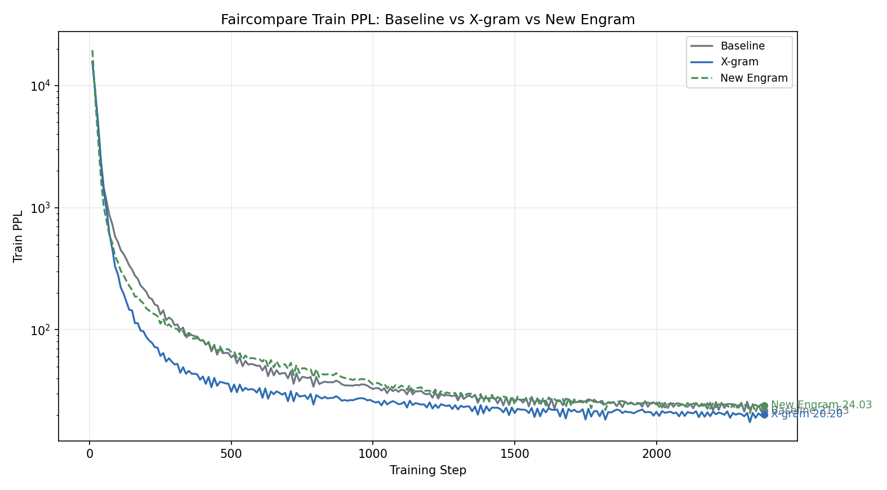
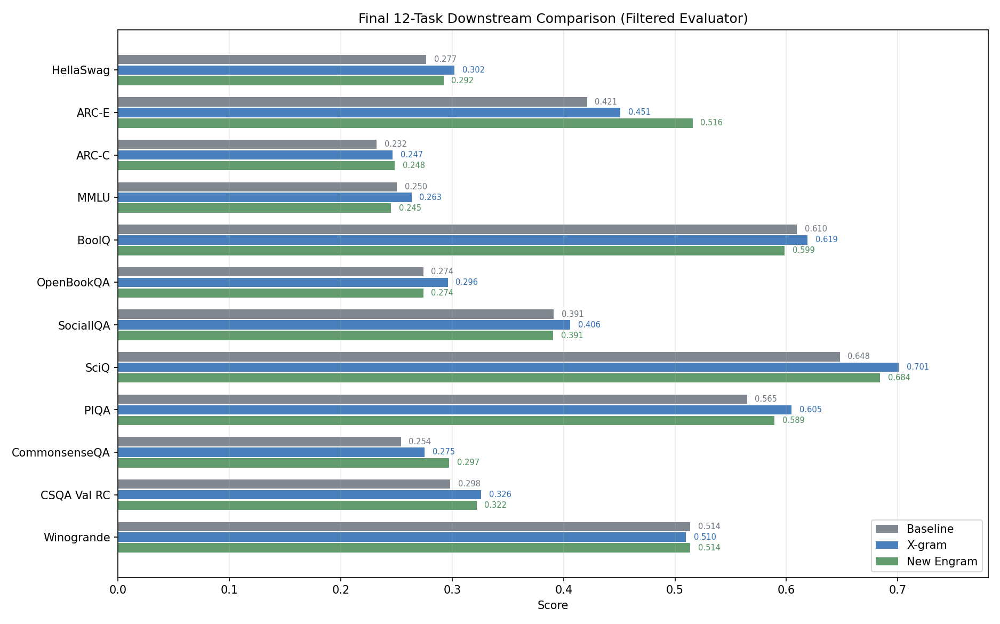
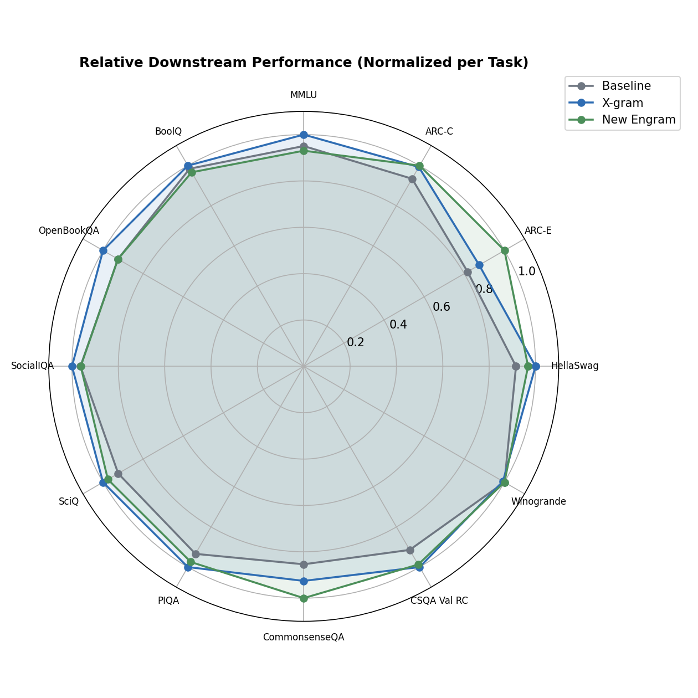

# New Engram / X-gram / Baseline 三模型 Faircompare 对比实验报告

日期：2026-07-27
目的：组会汇报用，包含模型参数量、训练曲线、12 项 filtered downstream 评测的完整三模型对比。
说明：格式仿照 `docs/20_EngramFaircompare_三模型对比实验报告_20260724/README.md`；本报告把原 Engram 替换为最新 `2g3g+xgrammatch` Engram。

---

## 1. 背景

本报告在 **faircompare** 统一口径下对比三个模型：
- **Baseline**: SmolLM2-360M 标准 backbone，无任何注入
- **X-gram**: Backbone + X-gram 注入（hash v-path + shortconv）
- **New Engram**: Backbone + 最新 2gram+3gram xgrammatch Engram 注入（32 层全覆盖，shortconv enabled）

三个模型使用相同的 backbone 架构、FineWeb 10B 训练数据、global_batch_size=512、train_tokens=10B、lr=3e-4。需要注意的是，New Engram 因显存压力使用 `micro_batch_size=1` 和 full activation checkpointing；Baseline/X-gram 使用 `micro_batch_size=4`。

---

## 2. 模型参数量

### 2.1 Backbone (SmolLM2-360M 风格)

| 组件 | 参数量 |
|:--|:--|
| Token Embedding (vocab=49152) | 47.19M |
| 每层 Attention (Q/K/V/O, GQA 15/3) | 2.21M |
| 每层 SwiGLU FFN (gate/up/down) | 7.37M |
| 每层 RMSNorm | 1.9K |
| 每层总参数 | 9.59M |
| 32 层合计 | 306.77M |
| LM Head (untied) | 47.19M |
| **Backbone 手算总计** | **401.14M** |
| **Baseline eval log 实测总计** | **401.18M** |

### 2.2 X-gram 额外参数

| 组件 | 说明 | 参数量 |
|:--|:--|:--|
| X-gram total params | eval log 实测 | 694.45M |
| X-gram non-embedding params | eval log 实测 | 354.03M |
| Total extra vs Baseline | total params 差值 | 293.27M |
| Non-embedding extra vs Baseline | non-embedding params 差值 | 34.6K |
| 注入配置 | `targets=[v]`, `v_layers=20`, shortconv kernels `[3,5,7]`, hash token map Cap=75968 | - |

### 2.3 New Engram 额外参数

| 组件 | 说明 | 参数量 |
|:--|:--|:--|
| New Engram total params | eval log 实测 | 704.41M |
| New Engram non-embedding params | eval log 实测 | 393.53M |
| Total extra vs Baseline | total params 差值 | 303.23M |
| Non-embedding extra vs Baseline | non-embedding params 差值 | 39.54M |
| Engram n-gram mode | `2gram+3gram`, `dim_per_ngram=320`, `ngram_heads=2`, `buckets=24576` | - |
| ShortConv | `engram_shortconv_enabled=true`, kernel=4 | - |

### 2.4 参数对比图

| 模型 | Total 参数 | Non-embedding 参数 | Total extra vs Baseline | Non-emb extra vs Baseline |
|:--|:--|:--|:--|:--|
| Baseline | 401.2M | 354.0M | 0 | 0 |
| X-gram | 694.5M | 354.0M | 293.3M | 34.6K |
| New Engram | 704.4M | 393.5M | 303.2M | 39.5M |

> **注意**：本节最终对比采用 eval log 实测参数量，而不是沿用 `docs/20` 的早期手算估计。原因是 X-gram 与 Engram 的注入实现中存在 embedding/hash table 计数细节，实测值更适合作为汇报口径。

---

## 3. 实验配置

### 3.1 三模型共同配置

| 项目 | 设置 |
|:--|:--|
| Backbone | SmolLM2-360M-style: 32 layers, hidden=960, FFN=2560, heads=15, GQA=3 |
| Dataset | FineWeb 10B tokens (streaming) |
| `global_batch_size` | 512 |
| `train_tokens` | 10,000,000,000 (~2385 steps) |
| `lr` | 3e-4 |
| `seq_len` | 4096 |
| Evaluation during train | downstream disabled |
| 评测口径 | filtered downstream 12-task global average |

### 3.2 各模型差异配置

| 配置项 | Baseline | X-gram | New Engram |
|:--|:--|:--|:--|
| Config 文件 | `faircompare_baseline_360m.yaml` | `faircompare_xgram_360m.yaml` | `faircompare_engram_2g3g_xgrammatch_360m.yaml` |
| Checkpoint | `runs/baseline-smollm2-360m-fineweb10b-64984/step2385` | `runs/xgram-smollm2-360m-fineweb10b-64971/step2385` | `runs/faircompare-engram-2g3g-xgrammatch-360m/step2385` |
| Eval log | `logs/downstream_eval_baseline_step2385_full_20260606-104406.log` | `logs/downstream_eval_xgram_step2385_full_20260606-162307.log` | `logs/downstream_eval_engram_2g3gxgrammatch_step2385_full_20260727-105716-91063.log` |
| `micro_batch_size` | 4 | 4 | 1 (AC full) |
| 注入模式 | 无 | X-gram (v-path) | Engram (H-path) |
| 注入层数 | 0 | 20 (`v_layers`) | 32 (`h_layers`, 全覆盖) |
| Engram n-gram mode | - | - | `2gram+3gram` |
| Engram dim_per_ngram | - | - | 320 |
| Engram buckets | - | - | 24576 |
| ShortConv | - | kernels `[3,5,7]`, 20 layers | enabled, kernel=4 |

---

## 4. 训练结果

### 4.1 训练曲线

三模型 CE Loss 对比：

三模型 PPL 对比：

> 注：Baseline 和 X-gram 曲线来自 `reports/*_full_metrics.csv`；New Engram 曲线来自 `logs/20260724-125126_faircompare_engram_2g3g_xgrammatch_360m_rank0.log` 逐 step 解析。

### 4.2 训练终点数值 (step ~2385)

| 模型 | 最后 step | Train CE Loss | Train PPL |
|:--|:--|:--|:--|
| Baseline | 2380 | 3.074 | 21.63 |
| X-gram | 2380 | 3.006 | 20.20 |
| New Engram | 2380 | 3.179 | 24.03 |

**分析**：
- 训练 CE/PPL 上，X-gram 仍然最低：CE=3.006, PPL=20.20。
- New Engram 的终点训练 CE=3.179, PPL=24.03，高于 Baseline 的 CE=3.074, PPL=21.63。
- 因此如果目标是“同配置下把 Engram 训练到更低 CE”，这次 New Engram run 是失败的；它没有达到 Engram 理论预期，也不能被称为当前最优 Engram。
- New Engram 的 downstream Global Average 高于 Baseline，只说明它在部分判别任务上有收益；这不能抵消训练 CE/PPL 比 Baseline 更差的问题。

---

## 5. 下游评测结果

### 5.1 Global Average

| 模型 | Global Average |
|:--|:--|
| Baseline | 0.3944 |
| X-gram | 0.4167 |
| New Engram | 0.4142 |

### 5.2 12 项任务终点对比

| 指标 | Baseline | X-gram | New Engram | 最高 |
|:--|:--|:--|:--|:--|
| HellaSwag | 0.2766 | 0.3020 | 0.2923 | X-gram |
| ARC-E | 0.4211 | 0.4509 | 0.5158 | New Engram |
| ARC-C | 0.2321 | 0.2466 | 0.2483 | New Engram |
| MMLU | 0.2504 | 0.2634 | 0.2451 | X-gram |
| BoolQ | 0.6095 | 0.6190 | 0.5985 | X-gram |
| OpenBookQA | 0.2740 | 0.2960 | 0.2740 | X-gram |
| SocialIQA | 0.3910 | 0.4058 | 0.3905 | X-gram |
| SciQ | 0.6480 | 0.7010 | 0.6840 | X-gram |
| PIQA | 0.5647 | 0.6045 | 0.5892 | X-gram |
| CommonsenseQA | 0.2539 | 0.2752 | 0.2973 | New Engram |
| CSQA Val RC | 0.2981 | 0.3260 | 0.3219 | X-gram |
| Winogrande | 0.5138 | 0.5099 | 0.5138 | Baseline / New Engram |

### 5.3 相对性能雷达图

### 5.4 各模型获胜统计（12 项任务，含并列）

| 模型 | 获胜任务数 | 获胜任务 |
|:--|:--|:--|
| Baseline | 1 | Winogrande |
| X-gram | 8 | HellaSwag, MMLU, BoolQ, OpenBookQA, SocialIQA, SciQ, PIQA, CSQA Val RC |
| New Engram | 4 | ARC-E, ARC-C, CommonsenseQA, Winogrande |

**总结**：X-gram 的 Global Average 为 0.4167，仍是最高；New Engram 为 0.4142，比 Baseline 高 +0.0198，但比 X-gram 低 0.0025。

---

## 6. New Engram 结果分析

### 6.1 New Engram 强项

New Engram 相对 X-gram 领先的任务是 ARC-E (+0.0649), CommonsenseQA (+0.0221), Winogrande (+0.0039), ARC-C (+0.0017)。其中 ARC-E 的提升最大，说明恢复 2gram+3gram、增大 `dim_per_ngram` 并打开 shortconv 后，Engram 在部分 ARC/commonsense 类任务上确实能超过 X-gram。

### 6.2 New Engram 短板

X-gram 相对 New Engram 领先最明显的任务是 OpenBookQA (+0.0220), BoolQ (+0.0205), MMLU (+0.0183), SciQ (+0.0170)。这些差距主要集中在 OpenBookQA、BoolQ、MMLU 和 SciQ 上，因此 X-gram 仍靠更均衡的任务覆盖面拿到最高 Global Average。

### 6.3 相对 Baseline

New Engram 相对 Baseline 提升最明显的任务是 ARC-E (+0.0947), CommonsenseQA (+0.0434), SciQ (+0.0360), PIQA (+0.0245)。这说明 New Engram 不是只在 n-gram 训练目标或 CE loss 上有变化，它的 downstream global average 也从 Baseline 的 0.3944 提升到 0.4142。

---

## 7. 当前状态总结 (2026-07-27)

### 7.1 已完成

- Baseline faircompare 训练 + step2385 12 项 filtered downstream 评测
- X-gram faircompare 训练 + step2385 12 项 filtered downstream 评测
- New Engram 2g3g+xgrammatch 训练完成，checkpoint 为 `runs/faircompare-engram-2g3g-xgrammatch-360m/step2385`
- New Engram step2385 完整 filtered downstream 评测完成，评测完成时间为 2026-07-27 11:15:15

### 7.2 Runs 状态

| Run / Log | 名称 | 最终 Checkpoint | 状态 |
|:--|:--|:--|:--|
| `baseline-smollm2-360m-fineweb10b-64984` | Baseline | step2385 | 完成 |
| `xgram-smollm2-360m-fineweb10b-64971` | X-gram | step2385 | 完成 |
| `faircompare-engram-2g3g-xgrammatch-360m` | New Engram | step2385 | 完成 |

### 7.3 核心发现

1. **X-gram 仍是当前 downstream 最强**：Global Average=0.4167，比 New Engram 高 0.0025。

2. **New Engram 的训练目标失败**：终点 CE=3.179，高于 Baseline 的 CE=3.074。这说明本次 2g3g+xgrammatch 配置没有把 Engram 优化到我们预期的状态。

3. **New Engram 的 downstream 仍有局部收益**：Global Average=0.4142，比 Baseline 高 +0.0198；它在 ARC-E、ARC-C、CommonsenseQA、Winogrande 上超过或追平 X-gram，但在 BoolQ、MMLU、OpenBookQA、SciQ 上落后。

4. **不能用 downstream 局部提升包装训练失败**：这次结果最多说明 Engram 注入带来了任务偏置收益，不说明语言建模能力更强。后续必须先解决 CE/PPL 劣化，再谈是否能超过 X-gram。

### 7.4 后续方向

- 针对 BoolQ、MMLU、OpenBookQA、SciQ 分析 New Engram 相对 X-gram 的短板。
- 补跑 New Engram 的 GSM8K/TriviaQA generation EM，使报告可完全覆盖 `docs/20` 的生成式任务口径。
- 继续探索 Engram 的容量、bucket、shortconv 和注入层配置，验证是否能把 ARC/commonsense 的收益扩展到更多任务。

---

## 8. 生成图像清单

| 图像 | 文件 |
|:--|:--|
| 三模型参数对比 | `images/faircompare_23_param_comparison_20260727.png` |
| 三模型 CE Loss 对比 | `images/faircompare_23_full_ce_loss_three_way_20260727.png` |
| 三模型 PPL 对比 | `images/faircompare_23_full_ppl_three_way_20260727.png` |
| 12 任务终点对比 | `images/faircompare_23_downstream_12_tasks_three_way_20260727.png` |
| 相对性能雷达图 | `images/faircompare_23_downstream_radar_20260727.png` |
