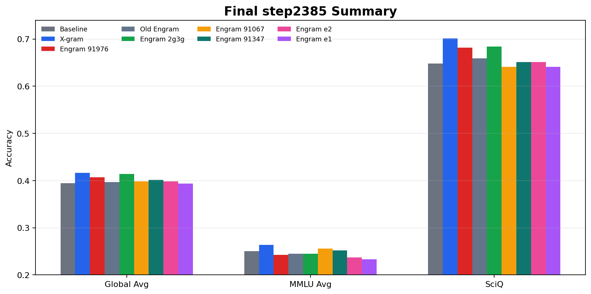
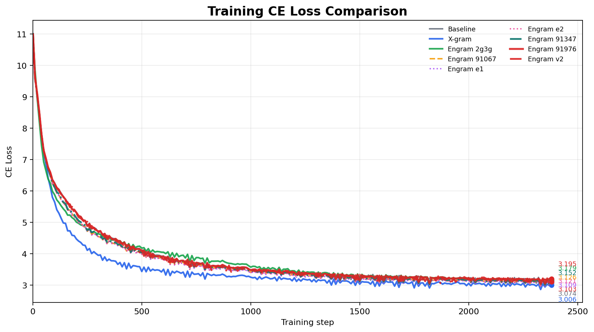
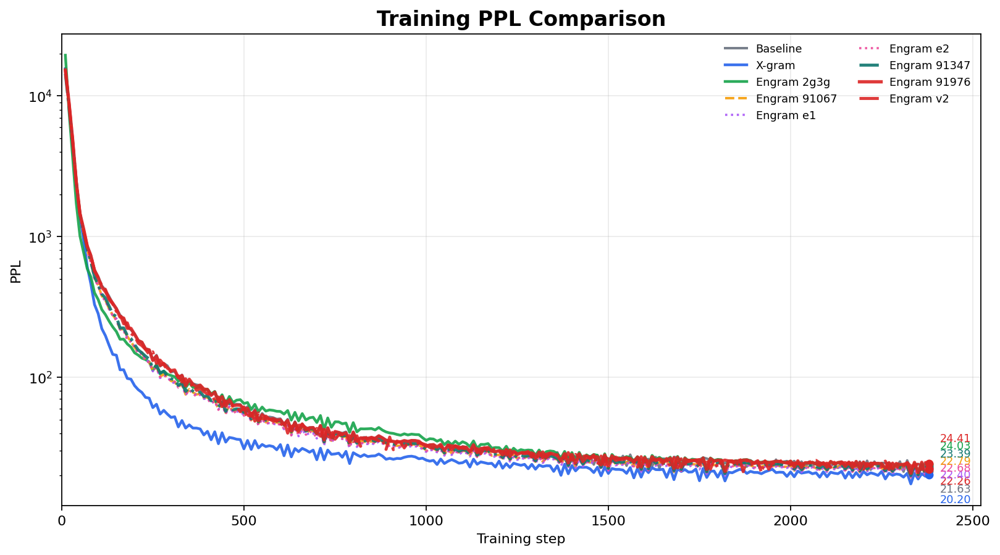
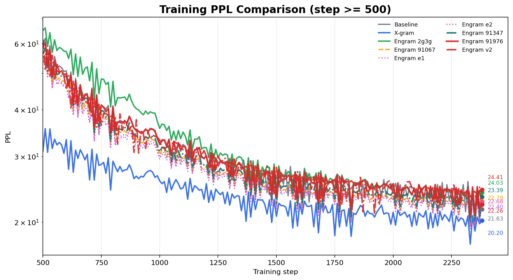
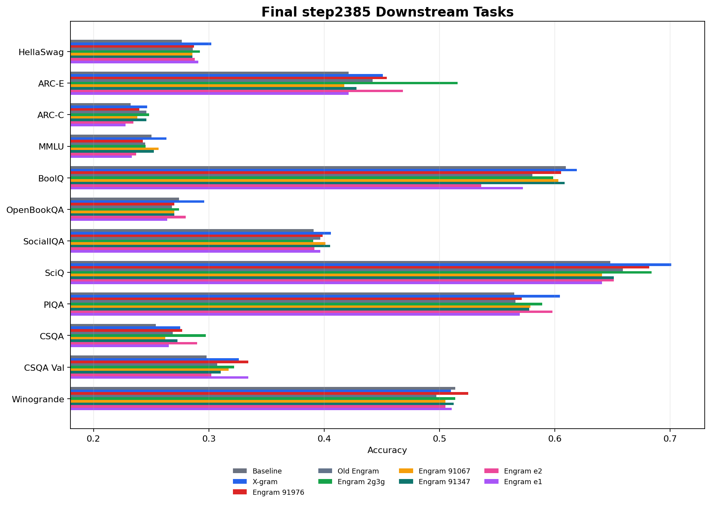

# Engram 最新 Faircompare 对比结果报告

---

## 1. 当前结论

目前已完成结果里，**整体效果最好的是 X-gram**。新版公平 Engram `91976` 已经完成 final checkpoint 和 full downstream，但还没有超过 X-gram，也没有超过旧 Engram 2g3g 的 Global。

| 模型 | Train CE | Train PPL | Downstream Global | MMLU | SciQ | 结论 |
|:--|--:|--:|--:|--:|--:|:--|
| Baseline | 3.074 | 21.63 | 0.3944 | 0.2504 | 0.6480 | 已有 control |
| X-gram | **3.006** | **20.20** | **0.4167** | **0.2634** | **0.7010** | 当前已完成模型整体最强 |
| Engram v-path 91976 | 3.195 | 24.41 | 0.4073 | 0.2427 | 0.6820 | 新版公平 Engram；高于 Baseline Global/SciQ，但低于 X-gram |
| Engram 2g3g | 3.179 | 24.03 | 0.4142 | 0.2451 | 0.6840 | 当前已完成 Engram 中 Global 最强，但不是新版公平口径 |
| Engram 2gram 91067 | 3.126 | 22.79 | 0.3980 | 0.2563 | 0.6410 | 未超过 Baseline/X-gram |
| Engram e1 91069 | 3.109 | 22.40 | 0.3939 | 0.2333 | 0.6410 | 略低于 Baseline |
| Engram e2 91070 | 3.121 | 22.68 | 0.3985 | 0.2371 | 0.6510 | 未超过 Baseline/X-gram |
| Engram improved-v1 91347 | 3.152 | 23.39 | 0.4016 | 0.2522 | 0.6510 | final eval 已补；legacy H-path 兼容口径 |



---

## 2. 之前 Engram 的问题

旧 Engram 全部没有稳定超过 Baseline，主因不在 X-gram setting，而在旧 H-path Engram 的实现和配置组合：

1. **没有公平 warm-up**  
   旧 Engram 注入从训练一开始就直接进入主干；X-gram 有 warm-up/scale 控制。随机初始化的 n-gram 注入过早介入，会放大训练初期扰动。

2. **H-path 没有统一乘外部 scale**  
   旧 H-path Engram 没有和 X-gram 对齐使用 `lambda * depth_scale * warmup`。这会让 Engram 的注入强度、打开时机和 X-gram 不一致。

3. **旧 CE/PPL 不能直接判定 Engram 机制失败**  
   旧 Engram 的 CE/PPL 低于 Baseline，更多说明旧实现/setting 不公平，而不是说明 Engram 机制本身一定无效。

4. **参数统计和 optimizer 覆盖不完整**  
   旧实现里 v-path Engram 参数统计容易不准，optimizer override 也没有完整覆盖 H/V 注入模块。

一句话：**旧 Engram 的核心问题是注入控制没有和 X-gram 对齐，尤其缺 warm-up，所以旧结果不适合直接拿来做公平结论。**

---

## 3. 最新 Engram 的改动

已经完成的修复：

1. **给 Engram 加了 warm-up**  
   Engram 注入现在会乘 `warmup_scale_tensor`，训练初期逐步打开。

2. **H-path 统一注入公式**  
   当前修复后的注入强度为：

   ```text
   delta * lambda * depth_scale * warmup
   ```

3. **新增 Engram v-path**  
   Engram 现在可以像 X-gram 一样注入到 attention 的 `v` 路径，便于做机制差异之外尽量对齐的实验。

4. **新增 Engram-only faircompare 配置**  
   使用 `configs/faircompare_engram_vpath_xgrammatch_360m.yaml`，只重跑 Engram；Baseline/X-gram 不重跑。

5. **对齐关键 setting**  
   新 Engram 对齐 X-gram 的 `v_layers`、batch/token budget、训练 token 数、warm-up 逻辑，只保留机制差异。

6. **修复参数统计和 optimizer override**  
   Engram v-path 参数统计已修正；optimizer override 覆盖 H/V 注入参数。

7. **为旧 checkpoint 增加 legacy H-path 兼容评测开关**  
   `91347` 这类旧 H-path checkpoint 按旧公式 `h = h + engram(input_ids, h)` 加载评测；新版 fair Engram 默认不启用该兼容分支。

已验证：

- Python 编译检查通过。
- H-path smoke：warmup=0 时 delta 为 0；warmup=0.5 时约为 warmup=1 的一半。
- V-path smoke：warmup=0 时 delta 为 0；warmup=0.5/1.0 比例为 0.5。
- `scripts/validate_engram_xgrammatch_config.py` 已通过。
- `91976 step2385` SciQ smoke 和 full downstream 都已完成。

---

## 4. 新版公平 Engram run

真正可 compare 的新版 Engram 是：

| 项 | 内容 |
|:--|:--|
| Job ID | `91976` |
| Run name | `faircompare-engram-vpath-xgrammatch-91976` |
| Config | `configs/faircompare_engram_vpath_xgrammatch_360m.yaml` |
| Checkpoint | `runs/faircompare-engram-vpath-xgrammatch-91976/step2385` |
| 训练日志状态 | `Training complete`，`Cleanup process completed successfully` |
| Slurm 状态 | checkpoint 和 eval 完成后手动 `scancel` 释放 8 张 L40S；最终状态 `CANCELLED by 1105` 不是训练失败 |
| 最新可记录训练点 | step2380 CE **3.195**, PPL **24.41** |
| SciQ smoke eval | job `92598`, SciQ **0.6820** |
| Full downstream eval | job `92599`, Global **0.4073**, MMLU **0.2427**, SciQ **0.6820** |
| 节点 | training: `node11` L40S, eval: `node8` ADA6000 |

结论：`91976` 是当前最公平的新版 Engram 对照结果。它确实比 Baseline 的 Global 更高，但没有超过 X-gram，也没有超过旧 Engram 2g3g 的 Global。

---

## 5. Engram 历史结果

### 5.1 训练曲线

历史训练曲线已按最新日志重画，包含：

- 91347 到 step2380 的 final train point。
- 91976 到 step2380 的 final train point，并保存 step2385 checkpoint。
- 91674 到 step2380 的 final train point；downstream 尚缺。








### 5.2 Downstream 12 项

| 指标 | Baseline | X-gram | Engram 91976 | Old Engram | Engram 2gram 91067 | Engram 2g3g | Engram 91347 | Engram e1 | Engram e2 |
|:--|--:|--:|--:|--:|--:|--:|--:|--:|--:|
| MMLU avg | 0.2504 | 0.2634 | 0.2427 | 0.2447 | 0.2563 | 0.2451 | 0.2522 | 0.2333 | 0.2371 |
| ARC-C | 0.2321 | 0.2466 | 0.2398 | 0.2457 | 0.2381 | 0.2483 | 0.2457 | 0.2278 | 0.2346 |
| ARC-E | 0.4211 | 0.4509 | 0.4544 | 0.4421 | 0.4175 | 0.5158 | 0.4281 | 0.4211 | 0.4684 |
| BoolQ | 0.6095 | 0.6190 | 0.6055 | 0.5804 | 0.6031 | 0.5985 | 0.6086 | 0.5725 | 0.5361 |
| CommonsenseQA | 0.2539 | 0.2752 | 0.2768 | 0.2686 | 0.2621 | 0.2973 | 0.2727 | 0.2654 | 0.2899 |
| CSQA Val RC | 0.2981 | 0.3260 | 0.3342 | 0.3071 | 0.3170 | 0.3219 | 0.3104 | 0.3342 | 0.3022 |
| HellaSwag | 0.2766 | 0.3020 | 0.2870 | 0.2860 | 0.2859 | 0.2923 | 0.2856 | 0.2907 | 0.2877 |
| OpenBookQA | 0.2740 | 0.2960 | 0.2700 | 0.2680 | 0.2700 | 0.2740 | 0.2700 | 0.2640 | 0.2800 |
| PIQA | 0.5647 | 0.6045 | 0.5713 | 0.5658 | 0.5789 | 0.5892 | 0.5778 | 0.5696 | 0.5979 |
| SciQ | 0.6480 | 0.7010 | 0.6820 | 0.6590 | 0.6410 | 0.6840 | 0.6510 | 0.6410 | 0.6510 |
| SocialIQA | 0.3910 | 0.4058 | 0.3987 | 0.3966 | 0.4012 | 0.3905 | 0.4053 | 0.3966 | 0.3915 |
| Winogrande | 0.5138 | 0.5099 | 0.5249 | 0.4972 | 0.5051 | 0.5138 | 0.5122 | 0.5107 | 0.5051 |
| **Global avg** | **0.3944** | **0.4167** | **0.4073** | **0.3968** | **0.3980** | **0.4142** | **0.4016** | **0.3939** | **0.3985** |

91347 final eval 已补齐：

- SciQ smoke：`logs/downstream_eval_engram_engram_improved_v1_91347_step2385_legacy_sciq_20260802-140413-92464.log`
- Full downstream：`logs/downstream_eval_engram_engram_improved_v1_91347_step2385_legacy_full_20260802-140623-92467.log`
- 兼容口径：`engram_legacy_h_path=true`，用于匹配 91347 checkpoint 的旧 H-path 结构；这不是新版 fair Engram 结论。

91976 final eval 已完成：

- SciQ smoke：`logs/downstream_eval_engram_faircompare_engram_vpath_xgrammatch_91976_step2385_sciq_20260802-161207-92598.log`
- Full downstream：`logs/downstream_eval_engram_faircompare_engram_vpath_xgrammatch_91976_step2385_full_20260802-161335-92599.log`
- 评测口径：新版 Engram v-path；不启用 legacy H-path；post-warmup checkpoint 评测时关闭 eval-time warmup，确保注入强度为训练末期 full strength。



---

## 6. 当前最好 Engram vs X-gram

在已经完成 full downstream 的所有 Engram 里，当前最好的是 **Engram 2g3g-xgrammatch**。它的 downstream Global 最接近 X-gram，但训练 CE/PPL 明显更差，而且它不是新版公平 v-path 对照口径。

| 指标 | X-gram | Engram 2g3g-xgrammatch | Engram v-path 91976 |
|:--|--:|--:|--:|
| Train CE | **3.006** | 3.179 | 3.195 |
| Train PPL | **20.20** | 24.03 | 24.41 |
| Global Avg | **0.4167** | 0.4142 | 0.4073 |
| MMLU Avg | **0.2634** | 0.2451 | 0.2427 |
| SciQ | **0.7010** | 0.6840 | 0.6820 |
| ARC-C | 0.2466 | **0.2483** | 0.2398 |
| ARC-E | 0.4509 | **0.5158** | 0.4544 |
| CommonsenseQA | 0.2752 | **0.2973** | 0.2768 |
| CSQA Val RC | 0.3260 | 0.3219 | **0.3342** |
| Winogrande | 0.5099 | 0.5138 | **0.5249** |

结论：

- **X-gram 仍是当前已完成模型里的整体最好结果**：CE/PPL、Global、MMLU、SciQ 都领先。
- **Engram 2g3g 是当前已完成 Engram 中 Global 最强**：Global `0.4142`，只低 X-gram `0.0025`，但不是新版公平 v-path 对照口径。
- **Engram 91976 是当前最公平的新版 Engram 结论**：Global `0.4073` 高于 Baseline `0.3944` 和 91347 `0.4016`，但低于 X-gram `0.4167` 和 Engram 2g3g `0.4142`。
- **warm-up 和对齐 setting 解决了公平性问题，但没有让 Engram 机制赢过 X-gram**：新版 91976 在 ARC-E、CommonsenseQA、CSQA Val、Winogrande 上有局部收益或接近 X-gram，但 MMLU、SciQ、PIQA、HellaSwag 等关键项仍落后。
